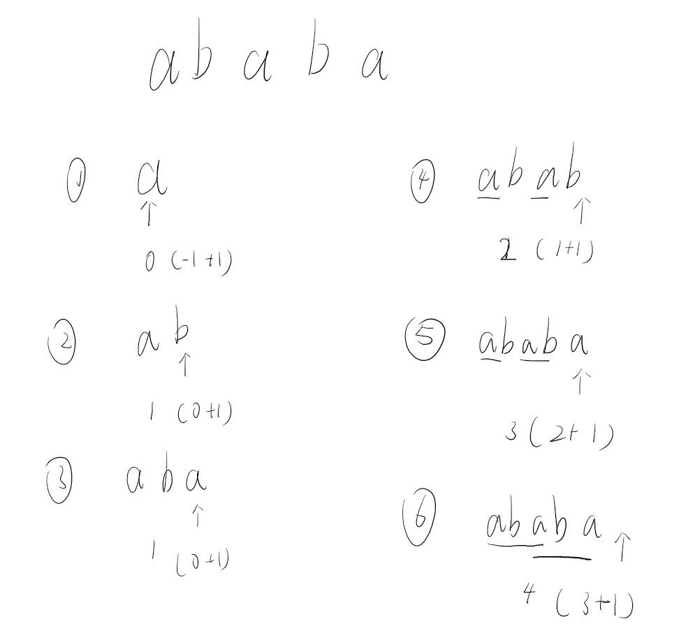
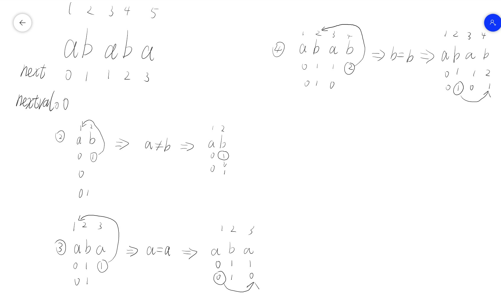
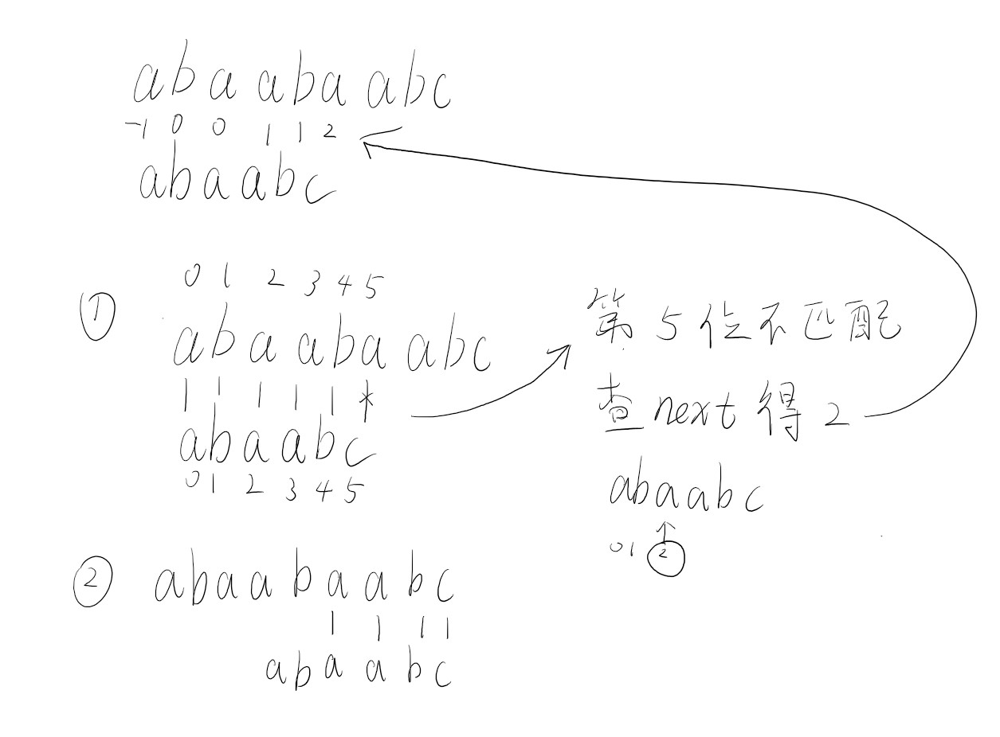

<!--
 * @Author: D_bxg
 * @Date: 2021-12-13 19:06:17
 * @LastEditors: D_bxg
 * @LastEditTime: 2021-12-13 19:48:10
 * @Description: file content
 * @FilePath: \data-structures-and-algorithms\c\1 Linear\1.4 String\README.md
-->
串，重点为BF算法和KMP算法，求next数组

