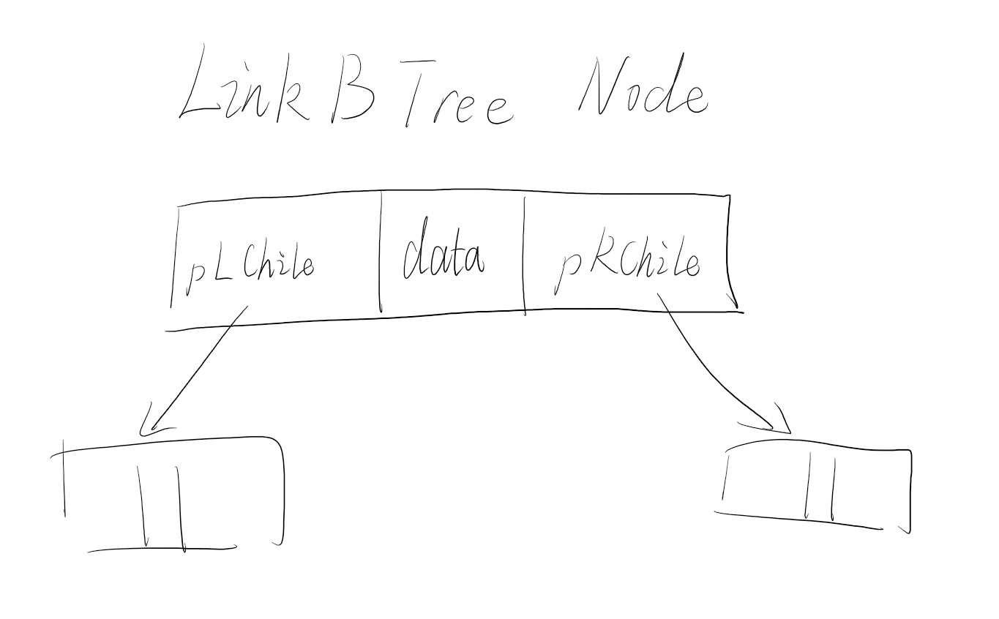

<!--
 * @Author: D_bxg
 * @Date: 2021-09-30 10:46:24
 * @LastEditors: D_bxg
 * @LastEditTime: 2021-12-13 19:58:01
 * @Description: file content
 * @FilePath: \data-structures-and-algorithms\c\2 Tree\2.1 BinaryTree\2.1.2 LinkBTree\README.md
-->
n个结点的链式存储的二叉树的空指针域为n+1个

