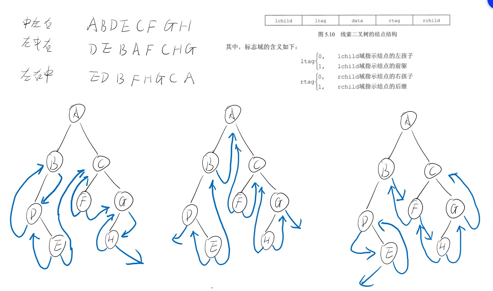

<!--
 * @Author: D_bxg
 * @Date: 2021-10-07 10:15:25
 * @LastEditors: D_bxg
 * @LastEditTime: 2021-12-13 20:02:43
 * @Description: file content
 * @FilePath: \data-structures-and-algorithms\c\2 Tree\2.1 BinaryTree\2.1.3 ThreadBinaryTree\README.md
-->
线索二叉树的循环链表

增加空结点
让空结点左指针指向根结点，
右指针指向尾结点，
第一个结点左指针指向空结点，
最后一个结点右指针指向尾结点。

