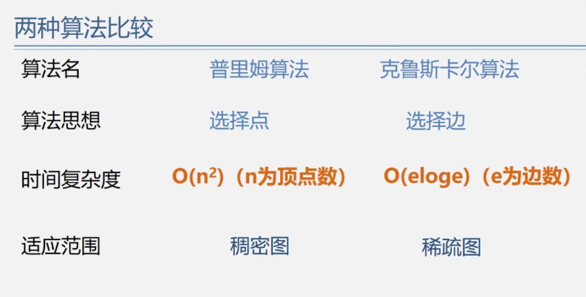

<!--
 * @Author: D_bxg
 * @Date: 2021-10-28 17:20:05
 * @LastEditors: D_bxg
 * @LastEditTime: 2021-10-28 18:09:41
 * @Description: file content
 * @FilePath: \Ce:\Code\Data-Structures-and-Algorithms\data-structures-and-algorithms\c\3 Graph\3.4 MinimumSpanningTree(MST)\README.md
-->

