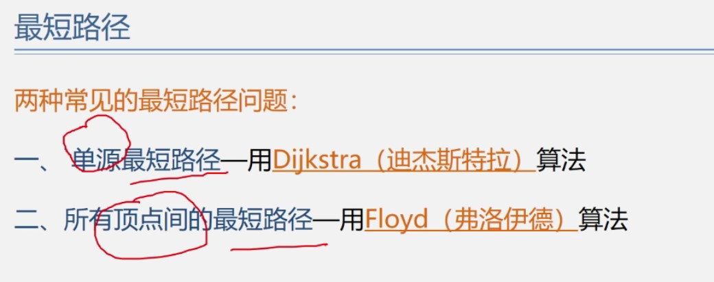

<!--
 * @Author: D_bxg
 * @Date: 2021-10-28 17:27:13
 * @LastEditors: D_bxg
 * @LastEditTime: 2021-10-29 15:30:12
 * @Description: file content
 * @FilePath: \Ce:\Code\Data-Structures-and-Algorithms\data-structures-and-algorithms\c\3 Graph\3.5 ShortestPath\README.MD
-->

Dijkstra 时间复杂度:O($n^2$)

Floyd 时间复杂度:O($n^3$)(如果用迪杰斯特拉，就是执行n次，复杂度也为$n^3$)

