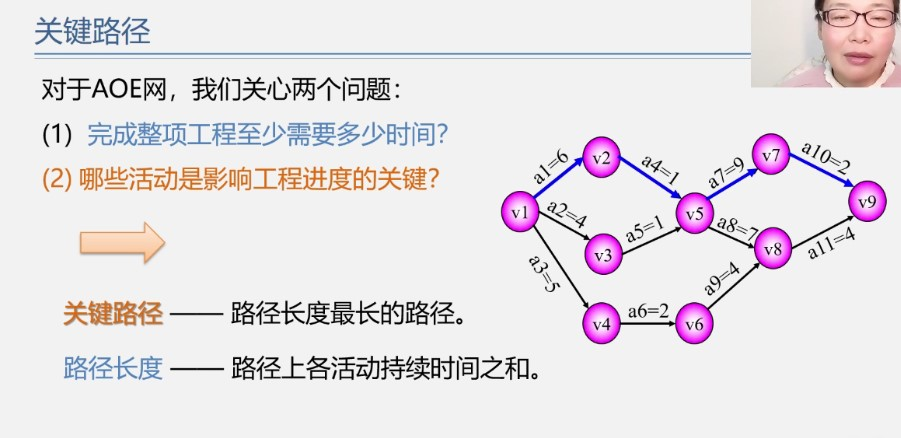
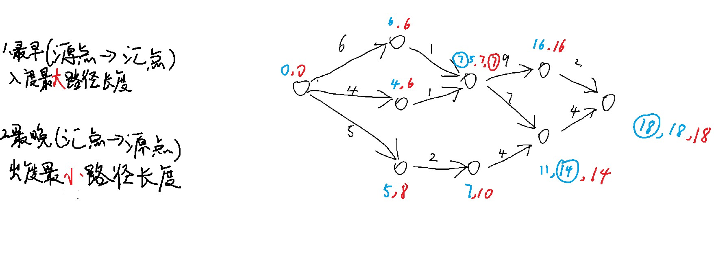

<!--
 * @Author: D_bxg
 * @Date: 2021-10-29 14:10:57
 * @LastEditors: D_bxg
 * @LastEditTime: 2021-10-29 15:30:11
 * @Description: file content
 * @FilePath: \Ce:\Code\Data-Structures-and-Algorithms\data-structures-and-algorithms\c\3 Graph\3.6 DirectedAcyclineGraph(DAG)\README.md
-->
## 有向无环图
用来描述工程的进行过程。
拓扑排序（Topological sort）
关键路径

## AOV网（ActivityOnVertex）（拓扑排序）
用来判断是否有回路
题型：
    求拓扑序列
    每次都删掉无前驱的节点和节点的出度边
    若序列包含所有结点，则说明无回路

## AOE网（ActivityOnEdge）（关键路径）
用来确定一件事情的执行顺序
有权网
源点（入度为0）
汇点（出度为0）

关键活动指最早和最晚时间相同

关键路径指链接最早最晚相减为零的事件得出的一条路径
