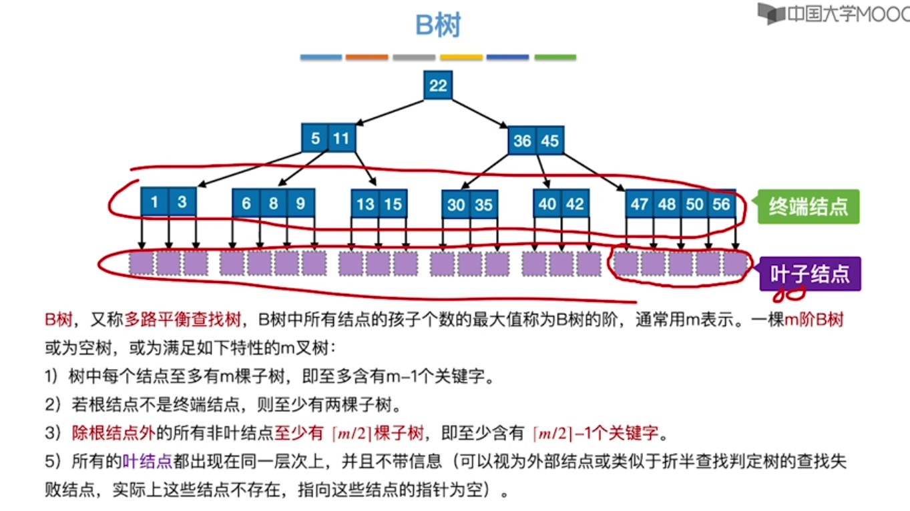
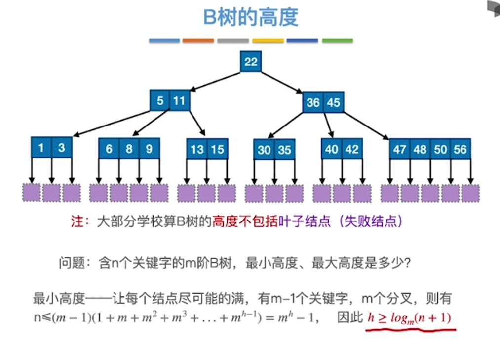
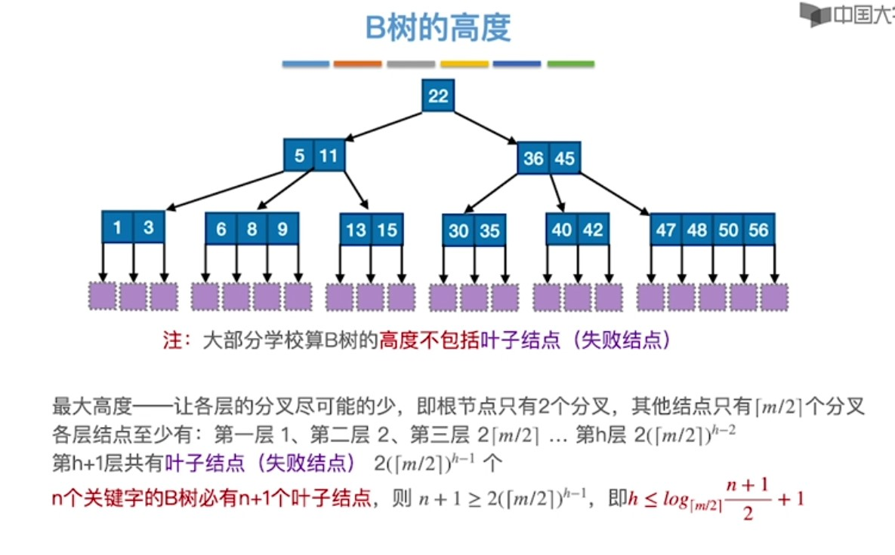
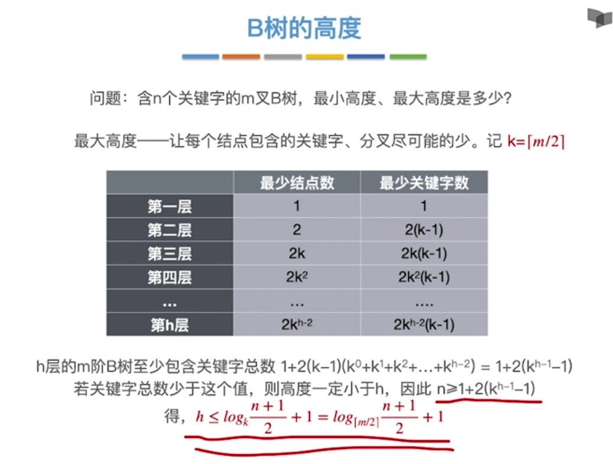
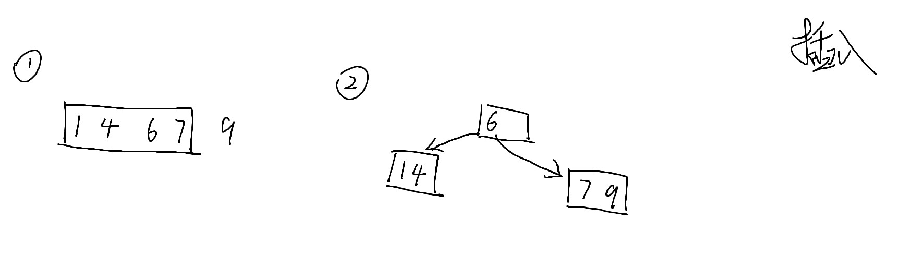
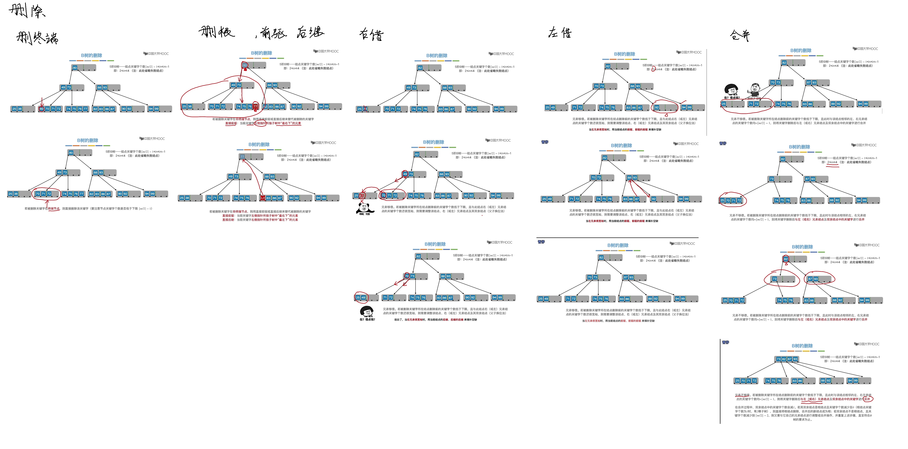

<!--
 * @Author: D_bxg
 * @Date: 2021-10-30 10:23:28
 * @LastEditors: D_bxg
 * @LastEditTime: 2021-10-31 14:26:13
 * @Description: file content
 * @FilePath: \Ce:\Code\Data-Structures-and-Algorithms\data-structures-and-algorithms\c\4 Algorithm\4.1 Search\4.1.2 Tree\1 B-tree\README.md
-->
B-tree

和平衡树有些区别，所有叶子节点都必须在同一层，一定是完全树

多路平衡查找树

多路：例如5叉树
```c
typedef int KeyType;
typedef struct ElemType{
    KeyType key;
    int data;
};
typedef struct Node{
    ElemType data[4]; // 存放4个数据，或者关键字
    struct Node* pNext[5]; // 存放5个指针，所以叫5叉树
}Node, *pNode;
```






# 插入



# 删除

