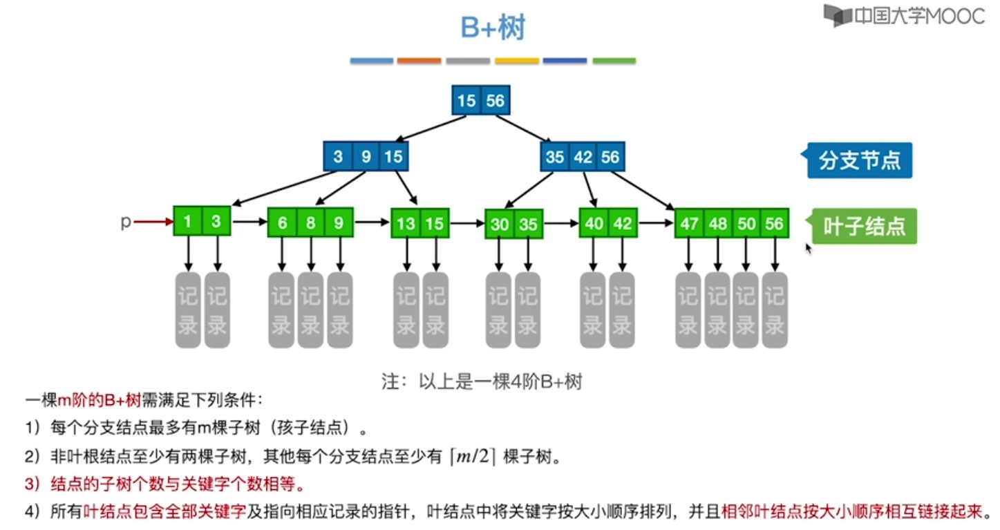
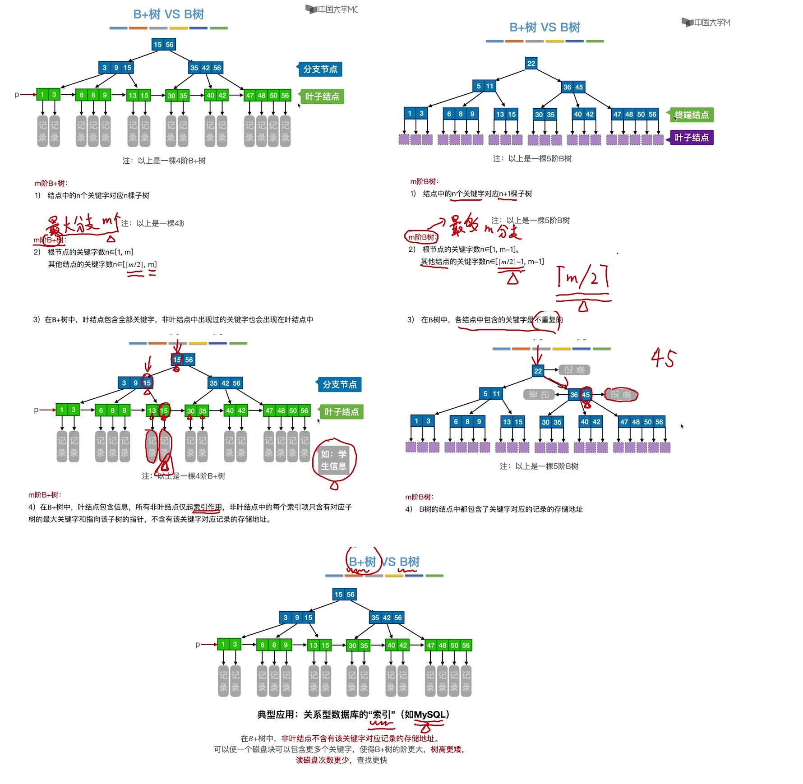

<!--
 * @Author: D_bxg
 * @Date: 2021-10-31 13:59:55
 * @LastEditors: D_bxg
 * @LastEditTime: 2021-10-31 14:21:40
 * @Description: 
 *      对应的存储结构为索引存储
 * @FilePath: \Ce:\Code\Data-Structures-and-Algorithms\data-structures-and-algorithms\c\4 Algorithm\4.1 Search\4.1.2 Tree\2 B+tree\README.md
-->

