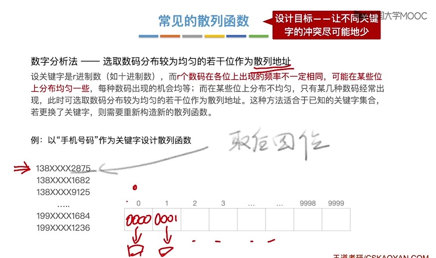

<!--
 * @Author: D_bxg
 * @Date: 2021-10-31 14:20:09
 * @LastEditors: D_bxg
 * @LastEditTime: 2021-10-31 16:21:03
 * @Description: 
 *      哈希是一种存储结构
 * @FilePath: \Ce:\Code\Data-Structures-and-Algorithms\data-structures-and-algorithms\c\4 Algorithm\4.1 Search\4.1.3 Hash\README.md
-->
```c
#include<stdio.h>

typedef int KeyType;

int H(KeyType key,int sub){ // 用来计算hash值的函数
    p = p(sub); // p为不大于申请下标个数m的最大质数
    int Addr = key % p;
    return Addr; // 输出关键值为key的结点应该放在哪个下标sub下
}

typedef struct ElemType{
    KeyType key;
    int data;
}ElemType;

typedef struct Node{
    ElemType* elem;
    ElemType* pNext;
}Node, * pNode;

typedef struct Table{
    pNode node; // 申请个数为m
}Table;

int main(){
    int key,addr;
    scanf("请输入要查询的数据的关键字：%d",&key);
    addr = H(key,sub);
    for(pNode i = Table.node[addr]; i->pNext != NULL; i = i->pNext){
        if(key == i->elem->key){
            printf("找到");
            return;
        }
    }
    
    while(1);
    return 1;
}
```

采用尾插法，也可以用头插法


如果未能查找到


散列函数 H(KeyType key,int sub)





处理冲突

算di


